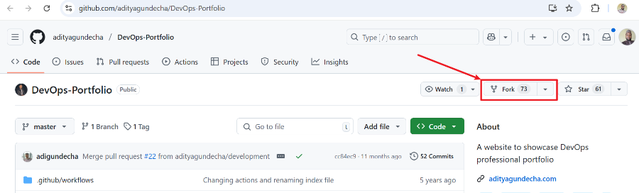
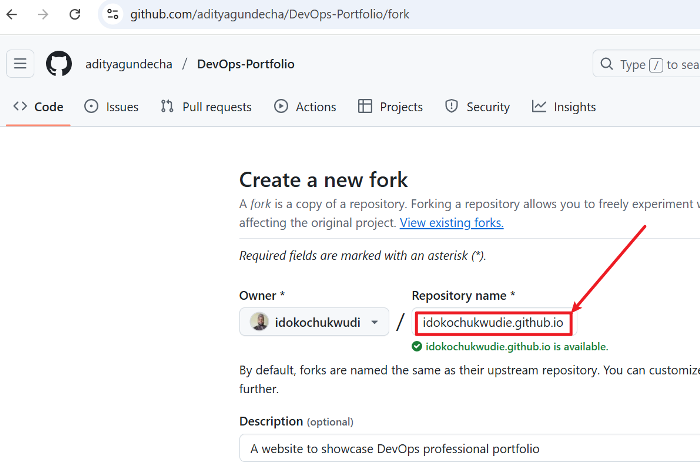
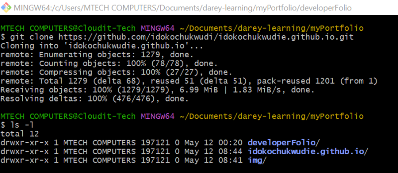
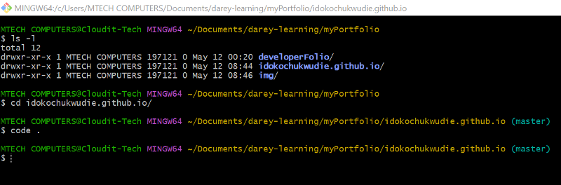
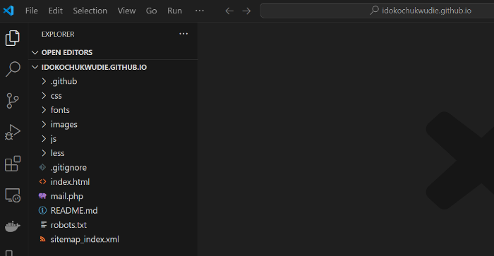
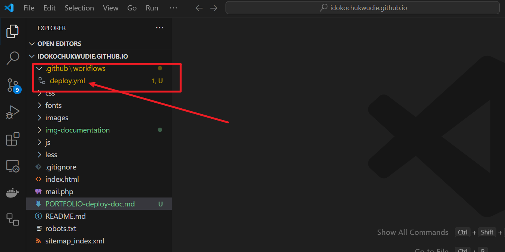
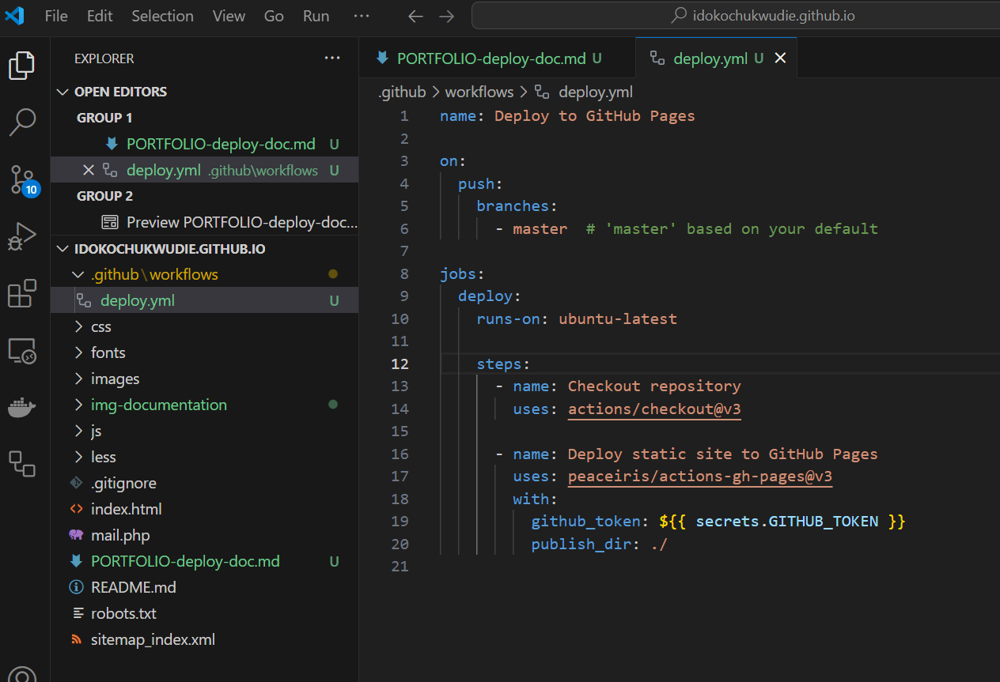

## DevOps Portfolio Deployment with GitHub Actions (CI/CD)

### Objective:

To create a live, professional DevOps portfolio at
https://idokochukwudie.github.io
— complete with automated deployment via GitHub Actions.

### Step 1: Fork the DevOps Portfolio Template

**Purpose:** i will start with a pre-built HTML/CSS portfolio designed for DevOps professionals.

- Visit: https://github.com/adityagundecha/DevOps-Portfolio

- Click the `“Fork”` button at the top right.

    

- Renamed my `forked repository` to:
`idokochukwudie.github.io`

    


**Why this name?**

GitHub will automatically serve my site at:
https://idokochukwudie.github.io

### Step 2: Clone and Customize Locally

**Purpose:** Personalize my `portfolio` — add **my name, bio, projects, and tools.**

**Clone the Repo**

```bash
git clone https://github.com/idokochukwudie/idokochukwudie.github.io.git
cd idokochukwudie.github.io
```



```bash
code .   # (This opens VS Code. Use your preferred editor)
```





### I will Edit These Files:

- **index.html** — update name, intro, and links

- **projects.html** — describe your DevOps projects

- **skills.html** — list tools like Docker, Kubernetes, Terraform, etc.

- **assets/img/** — replace with my profile picture or diagrams


### Stage 3: Set Up GitHub Actions Workflow for CI/CD

**Purpose:**

To automate the deployment of your static DevOps portfolio to GitHub Pages every time I push changes to your repository — a fundamental DevOps skill.

**🔧 Update: Existing Workflow Found**

When I cloned the template, there was already a GitHub Actions workflow named main.yml under:

```
.github/workflows/main.yml
```

This workflow was originally configured to deploy the site to **Netlify**, not GitHub Pages.

**What I Did:**

1. Renamed the workflow file from `main.yml` to `deploy.yml` for clarity and alignment with GitHub Pages:

    

2. Replaced the `Netlify` webhook script with a `GitHub` Pages deployment workflow using the `peaceiris/actions-gh-pages` action — ideal for plain `HTML/CSS/JS` portfolios.

    

### Step 4: Push Changes to GitHub

```bash
git add .
git commit -m "Initial customization and CI/CD setup"
git push origin main
```

