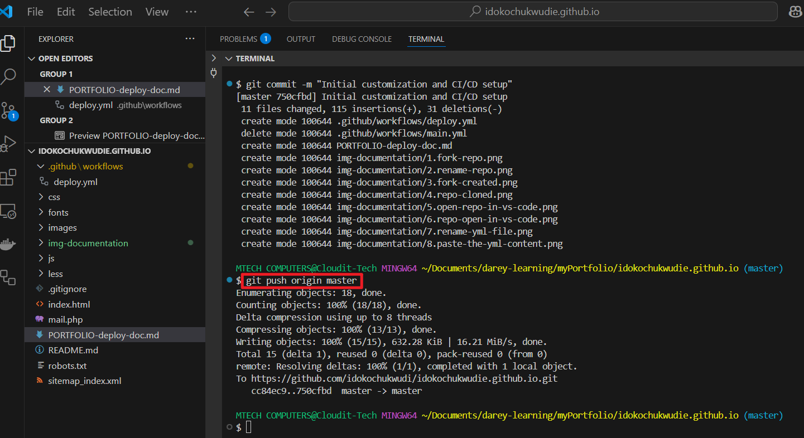
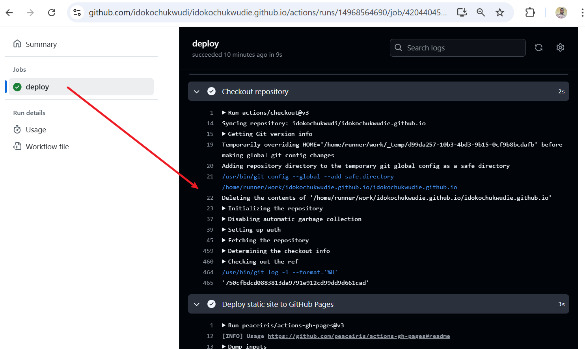
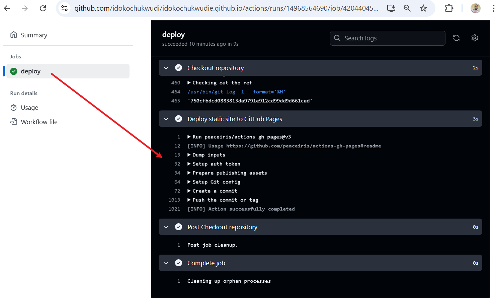
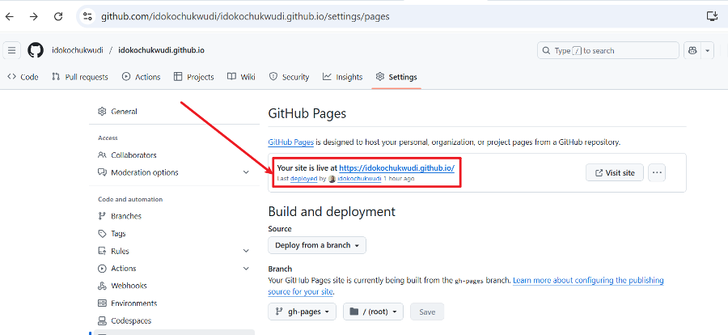
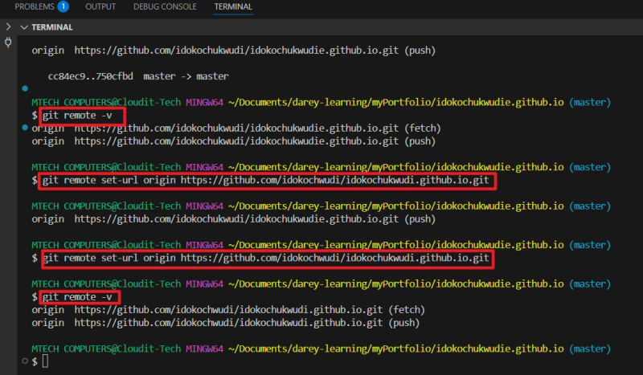

## DevOps Portfolio Deployment with GitHub Actions (CI/CD)

### Objective:

To create a live, professional DevOps portfolio at
https://idokochukwudi.github.io
— complete with automated deployment via GitHub Actions.

### Step 1: Fork the DevOps Portfolio Template

**Purpose:** I will start with a pre-built HTML/CSS portfolio designed for DevOps professionals.

- Visit: https://github.com/adityagundecha/DevOps-Portfolio

- Click the `“Fork”` button at the top right.

    

- Renamed my `forked repository` to:
`idokochukwudie.github.io`

    


**Why this name?**

GitHub will automatically serve my site at:
https://idokochukwudie.github.io

### Step 2: Clone and Customize Locally

**Purpose:** Personalize my `portfolio` — add **my name, bio, and tools.**

**Clone the Repo**

```bash
git clone https://github.com/idokochukwudie/idokochukwudie.github.io.git
cd idokochukwudie.github.io
```


```bash
code .   # (This opens VS Code. Use your preferred editor)
```


### I will Edit These Files:

- **index.html** — update name, intro, and links

- **assets/img/** — replace with my profile picture or diagrams


### Stage 3: Set Up GitHub Actions Workflow for CI/CD

**Purpose:**

To automate the deployment of my static **DevOps portfolio** to **GitHub Pages** every time I push changes to my repository.

**🔧 Update: Existing Workflow Found**

When I **cloned** the template, there was already a** GitHub Actions workflow** named `main.yml` under:

```
.github/workflows/main.yml
```

This workflow was originally configured to deploy the site to **Netlify**, not **GitHub Pages**.

**What I Did:**

1. Renamed the workflow file from `main.yml` to `deploy.yml` for clarity and alignment with GitHub Pages:

    

2. Replaced the `Netlify` webhook script with a `GitHub Pages deployment workflow` using the `peaceiris/actions-gh-pages` action — ideal for plain `HTML/CSS/JS` portfolios.

    

### Step 4: Push Changes to GitHub

```bash
git add .
git commit -m "Initial customization and CI/CD setup"
git push origin main
```




### Screenshots of Successful Deployment

Below are the screenshots of the successful deployment.






### Step 5: Configure GitHub Pages

1. Go to my GitHub repo: `idokochukwudie.github.io`
2. Click **Settings > Pages**
3. Under **Source**, choose:
      - GitHub Actions
      - Deploy from Branch: gh-pages
      - Folder: / (`root`)
4. Click `Save`


### Initial Access Error

When I initially visited the page at https://idokochukwudie.github.io/, an error message was displayed:

```
404  
There isn't a GitHub Pages site here.
```

This indicated that the GitHub Pages site had not yet been properly set up or deployed.


### Renaming Repository and Updating Local Remote URL

**Purpose:**

To ensure that my portfolio site is deployed correctly at `https://idokochukwudi.github.io`, the repository must be named **exactly** like the **GitHub username** followed by `.github.io`.

**Steps Taken:**

1. Renamed GitHub Repository

   - Initially, the repository was named: `idokochukwudie.github.io`
   - I renamed it via GitHub to match my correct username: `idokochukwudi.github.io`

This naming ensures GitHub Pages can deploy the site at:

➡️ `https://idokochukwudi.github.io`



**2. Updated Local Git Remote URL**

After renaming the repo on GitHub, I needed to update my local repository to reflect this change.

### Step-by-step:

```bash
# Navigate to your project folder
cd idokochukwudie.github.io

# Check the current remote URL
git remote -v

# Update the remote URL to the new repo name
git remote set-url origin https://github.com/idokochwudi/idokochukwudi.github.io.git

# Verify that the URL was updated
git remote -v
```



### Result:

My local Git repository now correctly points to the renamed remote repo, and I can push code without any issues. GitHub Pages also successfully renders the site at:

📍`https://idokochukwudi.github.io/`


## Conclusion

This project demonstrates a complete and practical walkthrough of deploying a personal portfolio website using GitHub Pages, from cloning an existing template to customizing, renaming, configuring GitHub Actions, and going live with a professional web presence.

More than just a personal exercise, this project is crafted to serve as a ready-made guide for any engineer or developer who wants to set up a fast, responsive, and visually engaging portfolio — without the need for complex backend infrastructure. Whether you're a new developer entering the job market or a seasoned engineer in need of a quick deployment, this project offers a streamlined approach using HTML, GitHub Actions, and GitHub Pages.

It not only highlights technical competence in source control, static hosting, and DevOps practices like CI/CD via GitHub Actions, but also reflects the ability to structure and document a project in a way that others can follow and reuse.

